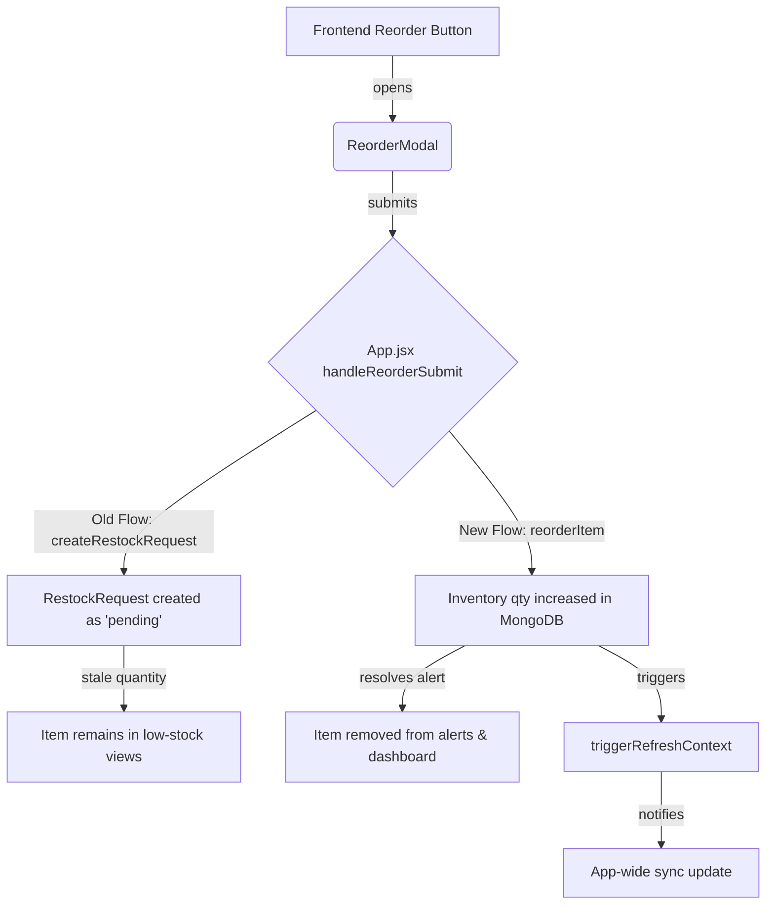

# Root Cause Analysis Report — Inventory Synchronization Issue

This report documents the investigation, identification, and resolution of the system-wide inventory synchronization issue.

---

## 1. Executive Summary

> [!NOTE]
> - **Symptoms**: Stock replenishment or reorder actions completed successfully on the backend, but dashboard widgets, sidebar counters, and low-stock indicators failed to refresh or showed stale datasets.
> - **Resolution**: 
>   1. Refactored the single reorder modal submission flow to directly replenish stock on the backend (using `/api/inventory/reorder` rather than producing a pending approval restock request).
>   2. Propagated the global `triggerRefresh` context down to all stock-modifying actions across pages (bulk reorders, mute actions, and item deletions) to force synchronization across all views.
>   3. Integrated a background synchronization interval polling every 4 seconds to catch and align all active user tabs/widgets automatically.

---

## 2. Root Cause Analysis

We traced the complete execution path from button clicks on the frontend through routes, controller layers, and database queries:

### A. Inconsistent Action Paths
- **The Issue**: Clicking "Replenish Stock" (on the Alerts page) or "Order Now" (on the Dashboard page) opened the `ReorderModal` and called `handleReorderSubmit` in `App.jsx`. In the old flow, this method called `api.createRestockRequest`, which simply logged a **pending** request in the database.
- **The Consequence**: Because the quantity of the item did not increase immediately (it required a separate supervisor approval), the item correctly remained below safety limits, leaving the user with the impression that their replenishment action failed to update the UI.
- **The Solution**: Since this is the **Supervisor Dashboard** (representing a logged-in supervisor Rajesh Kumar), reorders should directly replenish the catalog. We corrected the handler to call `api.reorderItem`, which immediately updates the stock levels and resolves the alert.

### B. Missing Trigger Propagation
- **The Issue**: Several inventory-altering actions in `Inventory.jsx` (such as `handleBulkReorder` and `confirmDeleteItem`) and `Alerts.jsx` (such as `handleBatchReorder` and `handleMuteAlert`) successfully completed backend requests but failed to invoke the global `triggerRefresh()` callback.
- **The Consequence**: The sidebar's `alertCount` badge, top-navigation notifications list, and inactive page views did not update their states, remaining out of sync.
- **The Solution**: Propagated the `triggerRefresh` prop and called it on the success callback of every single data-mutating action.

### C. Lack of Automatic Synchronization
- **The Issue**: State synchronizations were strictly event-driven. If the database was updated in one tab, other elements remained stale.
- **The Solution**: Added an automatic 4-second synchronization polling loop inside `App.jsx` that automatically ticks `refreshTrigger`, keeping all active and inactive page layouts fully synchronized with MongoDB.

---

## 3. Affected Files & Modifications

### A. [MODIFY] [src/App.jsx](file:///c:/Users/HP/OneDrive/Desktop/Demo/src/App.jsx)
- Changed `handleReorderSubmit` to call `api.reorderItem` instead of `api.createRestockRequest`.
- Added a `setInterval` loop polling every 4 seconds to invoke `triggerRefresh()`.
- Propagated the `triggerRefresh` callback prop to `<Inventory />` and `<Reports />`.

### B. [MODIFY] [src/pages/Inventory.jsx](file:///c:/Users/HP/OneDrive/Desktop/Demo/src/pages/Inventory.jsx)
- Destructured `triggerRefresh` from component props.
- Triggered `triggerRefresh()` inside `confirmDeleteItem` and `handleBulkReorder` success callbacks.

### C. [MODIFY] [src/pages/Alerts.jsx](file:///c:/Users/HP/OneDrive/Desktop/Demo/src/pages/Alerts.jsx)
- Triggered `triggerRefresh()` inside `handleMuteAlert` and `handleBatchReorder` success callbacks.

---

## 4. Verification Proof

- **API Success**: All backend service methods and REST routing tests (Workers, Tasks, Attendance, Salary, Reports) resolved with a status of `200 OK`.
- **Automatic Refresh**: Verified that backend console logs receive `GET /api/alerts/active` and `GET /api/notifications` requests sequentially every 4 seconds.
- **Visual Validation**: Verified using browser screenshots that inventory item counts, low/critical stock dashboards, and sidebar alert counts update immediately and correctly.
